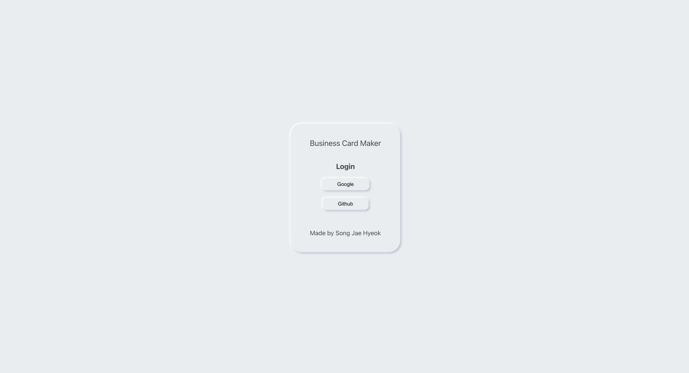
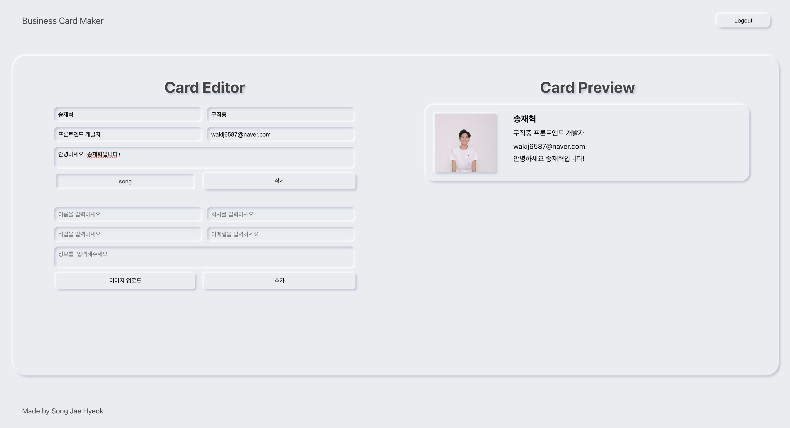

# BusinessCard
React 를 이용하여 명함을 제작, 보관하는 웹앱을 제작하였습니다.          
뉴모피즘을 컨셉으로 디자인하였습니다.          

## 사용 기술
 - HTML, CSS, PostCSS, JavaScript, React, Firebase API, Cloudinary

### PostCSS
PostCSS를 사용한 이유는 크로스 브라우징이 용이하고       
현재 많은 개발자들이 PostCSS를 활용하여 프로젝트를 진행하기 때문입니다.        
사용하고자 하는 jsx 파일 상단에 아래의 코드를 추가합니다.         

    import styles from './___.module.xss'

그 후 className="" 을 사용하는 것 대신 className={styles.클래스 이름} 을 사용합니다.          
공통되는 스타일이 여러 컴포넌트에서 중복적으로 사용되는 점을 효율적으로 관리하기 위하여            
color.css 파일을 만들어 추후 스타일이 변경되어도 빠르게 변경 가능하게 만들었습니다.                

color.css

    @value makerDarkGray: #454545;
    @value makerSkyBlue: #e9edf0;
    @value makerShadow: -2px -2px 5px #fff, 3px 3px 5px #babecc;
    @value makerShadowInset: inset -2px -2px 5px #fff, inset 3px 3px 5px #babecc;

### Firebase API
로그인 기능과 서버에 데이터를 저장하기 위하여 Firebase API를 사용하였습니다.        
서버 개발을 따로 하지 않고 데이터를 활용할 수 있다는 장점이 있습니다.        
firebaseApp만 따로 export default 하여 사용할 수 있지만 그렇게 되면        
불필요한 데이터까지 넘어가 버립니다. 따라서 auth와 database 등을 따로        
구분하여 내보내었습니다.        

firebase.js

    import firebase from "firebase/app";
    import "firebase/auth";
    import "firebase/database";

    const firebaseConfig = {
        apiKey: process.env.REACT_APP_FIREBASE_API_KEY,
        authDomain: process.env.REACT_APP_FIREBASE_AUTH_DOMAIN,
        projectId: process.env.REACT_APP_FIREBASE_PROJECT_ID,
    };
    // Initialize Firebase
    const firebaseApp = firebase.initializeApp(firebaseConfig);

    export const firebaseAuth = firebaseApp.auth();
    export const firebaseDatabase = firebaseApp.database();
    export const googleProvider = new firebase.auth.GoogleAuthProvider();
    export const githubProvider = new firebase.auth.GithubAuthProvider();

### Cloudinary
이미지를 웹상에 업로드하기 위하여 사용하였습니다.           
firebase를 이용하여 업로드 가능하지만 Cloudinary를 이용하면 사용자가          
올리는 이미지를 사이즈, 필터, 파일 변환 등 원하는 방식으로 조절할 수 있어 사용하였습니다.          
Cloudinary 사이트에 명시된 코드들을 활용하였습니다.        

image_uploader.js

    class ImageUploader {
        async upload(file){
            const data = new FormData();
            data.append('file', file);
            data.append('upload_preset', 'pdzaoz52');
            const result = await fetch(
                'https://api.cloudinary.com/v1_1/drqni4rhj/upload',
                {
                    method: 'post',
                    body: data,
                }
            );
            return await result.json();
        }
    }

    export default ImageUploader;

## 웹사이트 구성
로그인 페이지와 명함 제작 페이지를 제작하였습니다.      
React Router를 사용하여 페이지 간 이동을 하였습니다.        

로그인 페이지

명함 제작 페이지

명함 제작 페이지 반응형

### Login Page
로그인 페이지입니다. 사용자는 구글과 깃허브 계정으로 로그인할 수 있으며,        
로그인 시에는 React Router History를 이용하여 maker 페이지를 보여줍니다.        

로그인 버튼 클릭 시 onLogin 함수가 실행됩니다. 상위 컴포넌트에서 받아온         
authService 안에 있는 login이 실행되고 현재 버튼 안에 있는 텍스트 값을 받아와        
firebase를 이용하여 해당 사이트에 로그인합니다.                
로그인이 완료되면 history를 이용하여 페이지가 이동되고 state 안에         
접속한 로그인의 아이디 값을 받아와 저장합니다.        

사용자가 바뀔 경우 authService.onAuthChange가 실행되어        
새로운 아이디를 전달합니다.        

login.jsx

    const history = useHistory();
    const goMaker = (userId) => {
        history.push({
            pathname:"./maker",
            state : {id : userId},
        });
    }

    const onLogin = (e) =>{
        authService //
        .login(e.currentTarget.textContent)
        .then(data => goMaker(data.user.uid));
    };

    useEffect(() => {
        authService
        .onAuthChange(user => {
            user && goMaker(user.uid);
        });
    });
    .
    .
    .
    <button onClick={onLogin}>Google</button>

    <button onClick={onLogin}>Github</button>

auth_service.js

    login(providerName){
        const authProvider = this.getProvider(providerName);
        return firebaseAuth.signInWithPopup(authProvider);
    }

    onAuthChange(onUserChanged){
        firebaseAuth.onAuthStateChanged(user => {
            onUserChanged(user);
        })
    }

    getProvider(providerName){
        switch(providerName){
            case 'Google':
                return googleProvider;
            case 'Github':
                return githubProvider;
            default:
                throw new Error(`not supported provider: ${providerName}`);
        }
    }

### Header
로그인 시 페이지 좌측 상단에 로그아웃 버튼이 생기도록 하였습니다.        
login 화면에는 header에 onLogout을 전달하지 않아 버튼을 존재하지 않게 하고         
maker 화면에서는 onLogout을 전달하여 버튼이 보이도록 하였습니다.        

header.jsx

    <header className={styles.header}>
        <h1 className={styles.headerTitle}>Business Card Maker</h1>
        {onLogout && <button className={styles.logoutButton} onClick={onLogout}>Logout</button>}
    </header>

로그아웃 버튼 클릭 시 props로 받은 onLogout 함수가 실행됩니다.        
firebase에 제공하는 firebaseAuth.signOut()를 활용하여 로그아웃을 합니다.        

maker.jsx

    const onLogout = useCallback(
        () => {
            authService.logout();
        }, [authService]
    );

auth_service.js

    logout(){
        firebaseAuth.signOut();
    }

### Maker
명함을 제작, 보관하는 페이지입니다.       
아이디별로 데이터를 따로 저장하여 사용자마다 자신이 만들어둔 명함을       
새로 고침을 하여도, 나갔다 다시 들어와도 볼 수 있도록 하였습니다.       

maker.jsx

    useEffect(() => {
        if(!userId){
            return
        }
        const stopSync = cardRepository.syncCards(userId, cards => {
            setCards(cards);
        })

        return () => stopSync();
    }, [userId, cardRepository])

    useEffect(() => {
        authService.onAuthChange(user => {
            if(user) {
                setUserId(user.uid);
            } else{
                history.push("/");
            }
        })
    }, [authService, history]);

props로 받아온 cardRepository의 syncCards에 명함의 정보와        
접속 아이디를 넘겼습니다. firebaseDatabase의 경로를 아이디/cards로 지정해놔       
사용자마다의 파일을 각각 만들고 받아온 명함의 정보를 저장하였습니다.       

card_repository.js

    syncCards(userId, onUpdate){
        const ref = firebaseDatabase.ref(`${userId}/cards`);
        ref.on('value', snapshot => {
            const value = snapshot.val();
            value && onUpdate(value);
        });

        return () => ref.off();
    }

### Editor
maker에서 받은 명함들의 정보들을 map을 활용하여 화면에 나타내었습니다.       
추가하는 폼은 따로 만들어 화면이 비는 것을 방지하고 언제든 명함을 추가할 수 있게 하였습니다.       

    {Object.keys(cards).map(key => 
        <EditorForm
            key={key}
            FileInput={FileInput}
            card={cards[key]}
            updateCard={updateCard}
            deleteCard={deleteCard}
        />)}

    <EditorAddForm FileInput={FileInput} onAdd={addCard}/>

### Editor Form
onChange를 활용하여 사용자가 이미 만들어둔 명함을 수정하면 즉시 변경되도록 하였습니다.       
preventDefault로 기본적인 기능은 막고 props로 받아온 updateCard를 활용하여        
변경된 사항만 바뀌도록 하였습니다. delete 버튼 클릭 시 위와 마찬가지로        
deleteCard를 활용하여 제거하였습니다.       

editorForm.jsx

    const onChange = (e) => {
        if(e.currentTarget == null){
            return;
        }
        e.preventDefault();
        updateCard({
            ...card,
            [e.currentTarget.name]: e.currentTarget.value,
        })
    }
    
    const onSubmit = () => {
        deleteCard(card);
    }

내용이 바뀌면 데이터에 있는 정보 또한 수정하기 위하여        
cardRepository.saveCard(userId, card); 코드를 넣었습니다.       

내용이 삭제되면 데이터에 있는 정보 또한 삭제하기 위하여       
cardRepository.removeCard(userId, card); 코드를 넣었습니다.       

maker.jsx

    const AddUpdateCard = card => {
        setCards(cards => {
            const updated = {...cards};
            updated[card.id] = card;
            return updated;
        });
        cardRepository.saveCard(userId, card);
    };

    const deleteCard = card => {
        setCards(cards => {
            const updated = {...cards};
            delete updated[card.id];
            return updated;
        });
        cardRepository.removeCard(userId, card);
    };

card_repository.js

    saveCard(userId, card){
        firebaseDatabase.ref(`${userId}/cards/${card.id}`).set(card);
    }

    removeCard(userId, card){
        firebaseDatabase.ref(`${userId}/cards/${card.id}`).remove();
    }

### Editor Add Form
명함을 추가하기 위하여 만든 폼입니다.       
사용자가 텍스트를 입력하면 그 값들을 card에 저장한 후        
onAdd를 활용하여 정보를 넘겨 화면에 보여줍니다.       

editorAddForm.jsx

    const onSubmit = (e) => {
        e.preventDefault();
        const card = {
                id: Date.now(),
                name: nameRef.current.value || "",
                company: companyRef.current.value || "",
                job: jobRef.current.value || "",
                email: emailRef.current.value || "",
                introduce: introduceRef.current.value || "",
                fileName: imgData.fileName || "",
                fileURL: imgData.fileURL || "",
        }
        formRef.current.reset();
        setImgData({fileName:"", fileURL:""});
        onAdd(card);
    };

### 이미지 업로드 
사용자의 컴퓨터에 있는 이미지를 받아와 화면에 표시하기 위하여       
image_uploader.js 파일을 만든 후 cloudinary의 사이트에 있는 코드를 넣었습니다.       
그 후 index.js 파일에서 가져와 ImageFileInput에 props로 전달시켰습니다.       
이 컴포넌트를 props로 자식 요소에게 전달하여 이미지 업로드 버튼을 제작하였습니다.       
이미지를 업로드하게 되면 cloudinary에서 절대 이미지 경로와 이미지 이름을 받게 되고       
이를 화면에 표시하였습니다.       

index.js

    const imageUploader = new ImageUploader();
    const FileInput = memo(props => (<ImageFileInput {...props} imageUploader={imageUploader}/>));

input을 활용하여 파일을 업로드할 경우 ui가 아름답지 못하여 css로 안 보이게 하였고       
버튼 클릭 시 input이 실행되도록 하였습니다. 이미지를 변경하면 로딩 스피너를 가 보이도록 하였고       
업로드가 완료되면 로딩 스피너를 제거하고 이름이 보이도록 하였습니다.       

image_file.input.jsx

    const [loading, setLoading] = useState(false);

    const inputRef = useRef();

    const onChange = async e => {
        setLoading(true);
        const uploaded = await imageUploader.upload(e.target.files[0]);
        setLoading(false);
        onFileChange({
            name: uploaded.original_filename,
            url:uploaded.url,
        })
    } 

    const onClickInput = (e) => {
        e.preventDefault();
        inputRef.current.click();
    }
    .
    .
    .
    <input className={styles.imageInput} onChange={onChange} ref={inputRef} type="file" accept="image/*" name="profileImg"/>
    {!loading && <button className={`${styles.button} ${name?styles.activeInput:""}`} onClick={onClickInput}>
        {name || "이미지 업로드"}
    </button>}
    
    {loading && 

}

### Preview
Editor와 마찬가지로 map 을 이용하여 화면에 나타내었고        
editor에서 받아온 정보들을 보여주었습니다.       

preview.jsx

    {Object.keys(cards).map(key => <PreviewCard key={key} card={cards[key]}/>)}

previewCard.jsx

    const {name, company, job, email, introduce, fileURL} = card;

    const url = fileURL || defaultImg;

    return(
        <li className={styles.previewCard}>

            
            

                <h2 className={styles.name}>{name}</h2>
                
{company} {job}

                
{email}

                
{introduce}

            

        </li>

## 마무리 정리
1. 서버 쪽에서 데이터를 받아오는 경우 js 파일을 따로 만들어 index.js에서 받아온다.
2. 컴포넌트를 가져와 props로 전달할 수 있다. {...props}를 사용하여야 확장성이 좋다.

index.js

    const imageUploader = new ImageUploader();
    const FileInput = memo(props => (<ImageFileInput {...props} imageUploader={imageUploader}/>));

3. memo, useCallback를 사용하면 불필요한 업데이트를 막을 수 있다.
4. useCallback의 경우 한번 저장해두면 따로 설정하지 않는 이상 바뀌지 않기 때문에 조심하여야 한다. 
5. 로딩 스피너 -> 로드가 되기 전 true 완료되면 false로 만든다.

image_file_input.jsx

    setLoading(true);
    const uploaded = await imageUploader.upload(e.target.files[0]);
    setLoading(false);
    .
    .
    .
    {!loading && <button className={`${styles.button} ${name?styles.activeInput:""}`} onClick={onClickInput}>
        {name || "이미지 업로드"}
    </button>}

6. 중복되는 css는 따로 파일을 만들어 @value로 만든 후 다른 파일에서 가져다 사용한다. 
7. 배열의 이용하여 state를 계속 업데이트할 경우 배열의 길이가 늘어나면 성능이 좋지 않다.
따라서 오브젝트 형식으로 만들고 수정하고 싶은 부분의 키값만 가져와 그곳만 수정한다.       
오브젝트를 이용하면 map은 사용하지 못해 Object.keys(cards)를 이용하며 배열로 바꾼다.      

maker.js

    setCards(cards => {
        const updated = {...cards};
        updated[card.id] = card;
        return updated;
    });

editor.jsx

    Object.keys(cards).map(key =>...

송재혁입니다.      
감사합니다.